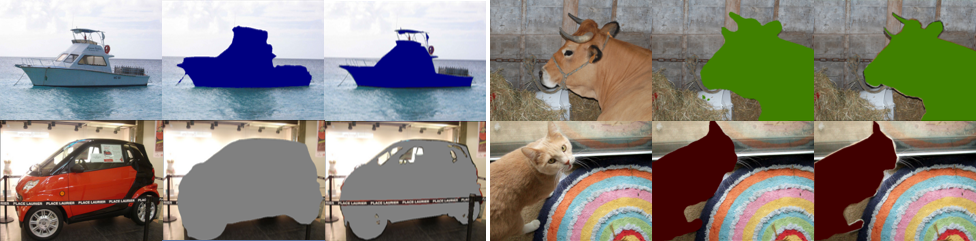

## HyperSeg - Official PyTorch Implementation

Example segmentations on the PASCAL VOC dataset.

This repository contains the source code for the real-time semantic segmentation method described in the paper:
> **HyperSeg: Patch-wise Hypernetwork for Real-time Semantic Segmentation**  
> *Conference on Computer Vision and Pattern Recognition (CVPR), 2021*  
> Yuval Nirkin, Lior Wolf, Tal Hassner  
> [Paper](https://arxiv.org/pdf/2012.11582.pdf)
>
> **Abstract:** *We present a novel, real-time, semantic segmentation network in which the encoder both encodes and generates the parameters (weights) of the decoder. Furthermore, to allow maximal adaptivity, the weights at each decoder block vary spatially. For this purpose, we design a new type of hypernetwork, composed of a nested U-Net for drawing higher level context features, a multi-headed weight generating module which generates the weights of each block in the decoder immediately before they are consumed, for efficient memory utilization, and a primary network that is composed of novel dynamic patch-wise convolutions. Despite the usage of less-conventional blocks, our architecture obtains real-time performance. In terms of the runtime vs. accuracy trade-off, we surpass state of the art (SotA) results on popular semantic segmentation benchmarks: PASCAL VOC 2012 (val. set) and real-time semantic segmentation on Cityscapes, and CamVid.*

## Installation
Install the following packages:
```Bash
git clone https://github.com/YuvalNirkin/hyperseg
cd hyperseg
conda env create -f hyperseg_env.yml
conda activate hyperseg
pip install -e .    # Alternatively add the root directory of the repository to PYTHONPATH.
```
Next, download the models and datasets:

## Models
| Template  | Dataset | Resolution | mIoU (%) | FPS | Link |
| :--- | :---: |  :---: |  :---: | :---: | :---: |
| HyperSeg-L | [PASCAL VOC](http://host.robots.ox.ac.uk/pascal/VOC) | 512x512 | 80.6 (val) | - | [download](https://github.com/YuvalNirkin/hyperseg/releases/download/v1.0/vocsbd_efficientnet_b3_hyperseg-l.pth) |
| HyperSeg-M | [CityScapes](https://www.cityscapes-dataset.com/) | 1024x512 | 76.2 (val) | 36.9 | [download](https://github.com/YuvalNirkin/hyperseg/releases/download/v1.0/cityscapes_efficientnet_b1_hyperseg-m.pth) |
| HyperSeg-S | [CityScapes](https://www.cityscapes-dataset.com/) | 1536x768 | 78.2 (val) | 16.1 | [download](https://github.com/YuvalNirkin/hyperseg/releases/download/v1.0/cityscapes_efficientnet_b1_hyperseg-s.pth) |
| HyperSeg-S | [CamVid](http://mi.eng.cam.ac.uk/research/projects/VideoRec/CamVid) | 768x576 | 78.4 (test) | 38.0 | [download](https://github.com/YuvalNirkin/hyperseg/releases/download/v1.0/camvid_efficientnet_b1_hyperseg-s.pth) |
| HyperSeg-L | [CamVid](http://mi.eng.cam.ac.uk/research/projects/VideoRec/CamVid) | 1024x768 | 79.1 (test) | 16.6 | - |

The models FPS was measured on an NVIDIA GeForce GTX 1080TI GPU.

Either download the models under `<project root>/weights` or adjust the `model` variable in the test configuration files.

## Datasets
| Dataset  | # Images | Classes | Resolution | Link | 
| :--- | :---: |  :---: |  :---: | :---: |
| [PASCAL VOC](http://host.robots.ox.ac.uk/pascal/VOC) | 10,582  | 21 | up to 500x500  | auto downloaded |
| [CityScapes](https://www.cityscapes-dataset.com/)  | 5,000  | 19 | 2048x1024  | [download](https://www.cityscapes-dataset.com/downloads/) |
| [CamVid](http://mi.eng.cam.ac.uk/research/projects/VideoRec/CamVid)  | 701 | 12 | 960x720 | [download](https://www.kaggle.com/carlolepelaars/camvid#) |

Either download the datasets under `<project root>/data` or adjust the `data_dir` variable in the configuration files.

## Training
To train the HyperSeg-M model on Cityscapes, set the *exp_dir* and *data_dir* paths 
in **cityscapes_efficientnet_b1_hyperseg-m.py** and run:
```Bash
python configs/train/cityscapes_efficientnet_b1_hyperseg-m.py
```

## Testing
### Testing a model after training
For example testing the HyperSeg-M model on Cityscapes validation set:
```Bash
python test.py 'checkpoints/cityscapes/cityscapes_efficientnet_b1_hyperseg-m' \
-td "hyperseg.datasets.cityscapes.CityscapesDataset('data/cityscapes',split='val',mode='fine')" \
-it "seg_transforms.LargerEdgeResize([512,1024])"
```

### Testing a pretrained model
For example testing the PASCAL VOC HyperSeg-L model using the available test configuration:
```Bash
python configs/test/vocsbd_efficientnet_b3_hyperseg-l.py
```

### Citation
```
@inproceedings{nirkin2021hyperseg,
  title={{HyperSeg}: Patch-wise Hypernetwork for Real-time Semantic Segmentation},
  author={Nirkin, Yuval and Wolf, Lior and Hassner, Tal},
  booktitle={IEEE/CVF Conference on Computer Vision and Pattern Recognition (CVPR)},
  month={June},
  year={2021}
}
```
